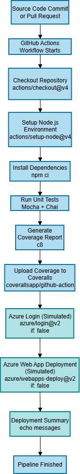

# Bonus Exercise: Deployment

This repository contains Bonus Exercise: Deployment for AT00BY10-3012 Ohjelmistojen ylläpito ja testaus course.

This purpose of this exercise is to extend the CI/CD pipeline created in Task VIII: Deployment by adding simulated Azure deployment steps to the workflow. These deployment stages mimic a reald Azure Web App pipeline but are intentionally disabled due to the lack of real Azure credentials.

For the full documentation on the Test Automation & Coverage project, see the previous repository in [Deployment](https://github.com/smyllykoski/Deployment)

## Objectives:

- extend GitHub Actions pipeline with Azure login and Azure Web App deployment (simulated)
- demonstrate how deployment would work in a real environment
- document pipeline structure, configurations, and simulation steps

## Project contents

### Unit tests (Mocha + Chai)

This bonus repository reuses the same test suite from Exercise VIII.  
Tests cover string, numeric, and collection utilities, including documented bugs in:

- `chunk`
- `camelCase`
- `compact`
- `defaultTo / defaultToAny`

Full details: [Deployment](https://github.com/smyllykoski/Deployment)

## Test coverage (c8 + Coveralls)

Coverage is identical to Exercise VIII.  
Generated via:

```bash
npm run coverage
```

See Coveralls page for the main project: [Coveralls: Deployment](https://coveralls.io/github/smyllykoski/Deployment)

The bonus pipeline includes coverage upload for completeness, but coverage content is unchanged.

## CI (GitHub Actions)

The workflow is located in `.github/workflows/ci.yml`

The CI pipeline performs:

1. Checkout repository
2. Setup Node.js
3. Install dependencies
4. Run tests
5. Generate coverage
6. Upload coverage to Coveralls
7. Azure Login (simulated)
8. Azure Deployment (simulated)
9. Deployment summary

**New Azure-related steps**

- Azure login (simulated)

  ```yaml
    - name: Azure Login (simulated)
        if: false
        uses: azure/login@v3
        with:
            creds: ${{ secrets.AZURE_CREDENTIALS }}
  ```

- Azure Web App deploy (simulated)
  ```yaml
  - name: Deploy to Azure Web App (simulated)
      if: false
      uses: azure/webapps-deploy@v2
      with:
          app-name: "placeholder-webapp"
          package: "."
  ```
- Deployment summary
  ```yaml
    - name: Deployment summary
        run: |
            echo "Azure deployment simulation complete"
  ```
  These steps do not run due to `if: false`, but show the correct structure for a real Azure pipeline.
  Workflow also supports `workflow_dispatch`, allowing manual triggering.

## Pipeline diagram
<p align="center">

</p>

## Observed bugs and Issue reports

See the previous project for full documentation of bugs discovered through test automation:
[Deployment](https://github.com/smyllykoski/Deployment)

## Test philosophy

The test design and documentation are described in detail in the original project:
[Deployment](https://github.com/smyllykoski/Deployment)

## How to run the project locally

1. Install dependencies
   ```bash
   npm install
   ```
2. Run tests
   ```bash
   npm test
   ```
3. Run coverage
   ```bash
   npm run coverage
   ```
4. View coverage report:
   - text in console
   - HTML report in `coverage/index.html`

## Conclusion

This bonus exercise demonstrates how to extend a CI pipelinr with an Azure deployment stage using GitHub Actions.
Although no actual Azure deployment occurs, the structure, workflow configuration, and steps accurately model an actual
CI/CD deployment pipeline.
